## Cover

<h3 align="center">
    <b>Kemanan Jaringan</b> 
    A01 Broken Access Control (OWASP 10 Juice Shop)
</h3>
 

  

 

    Nama : Saifudin  
    NRP : 3122640046

 

    Dosen pengampu: 
    Ferry Astika Saputra, S.T., M.Sc.

 

    <b>
        KELAS D4 LJ IT B  
        JURUSAN D4 LJ TEKNIK INFORMATIKA  
        DEPARTEMEN TEKNIK INFORMATIKA DAN KOMPUTER   
        POLITEKNIK ELEKTRONIKA NEGERI SURABAYA  
        2023
    </b>

 

## Laporan

CWE atau 34 Common Weakness Enumerations menunjukkan bahwa Broken Access Control lebih sering terjadi pada aplikasi dibandingkan dengan kategori kelemahan lainnya. Jika autentikasi dan pembatasan akses tidak diterapkan dengan baik, penyerang dan peretas dapat mengakses sistem tersebut. Dengan kata lain, Broken Access Control dapat memungkinkan masuknya entri yang tidak sah yang dapat menyebabkan kerentanan pada data dan file yang sensitif. Kontrol akses yang kurang kuat, terkait manajemen kredensial, dapat dihindari dengan menerapkan metode coding yang unik dan tindakan khusus, seperti mematikan akun administratif dan menggunakan autentikasi multi-faktor.

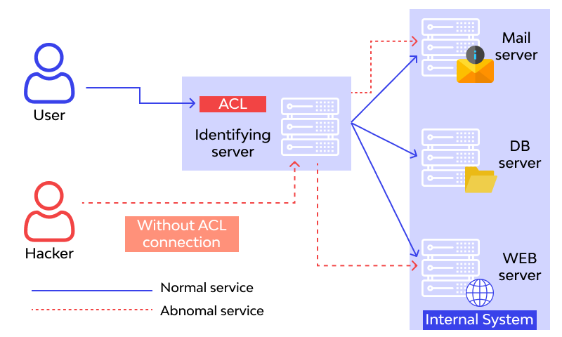

Gambar diatas menjelaskan bahwa user dapat mengakses pribadi pada server dengan Access Control List. Tetapi jika Access Control List tersebut tidak menghandle beberapa enpoint, maka orang lain atau hacker dapat mengakses data user tersebut pada server. 

Berikut ini macam-macam Broken Access Control yang berhasil ditemukan pada Website OWASP Juice Shop:

### A. Forged Feedback   

Kita akan menambahkan feedback kepada toko dengan username sebagai pengguna lain

1. Pergi kehalaman feedback /#/contract untuk memberikan feedback dan submit feedback tersebut

    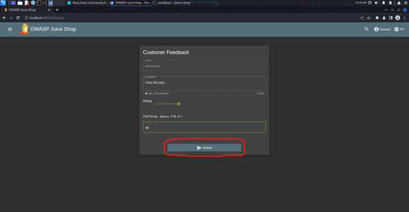

2. Pergi ke burp suite, pada tab proxy > HTTP History, cari endpoint dengan methode POST yang digunakan untuk mengupdate data feedback

    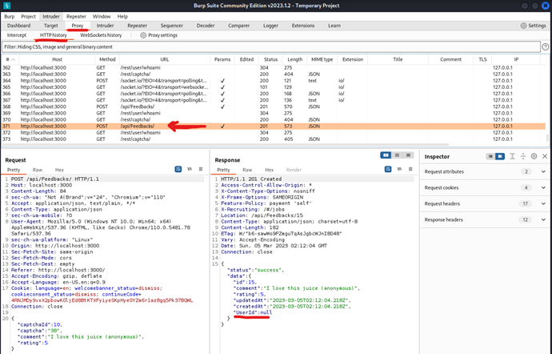

    Perhatikan data response pada endpoint tersebut bahwa terdapat “UserId” dengan data null, yang menandakan bahwa user yang membuat feedback adalah user anonymous.

3. Langkah selanjutnya, klik kanan pada request, lalu klik send to repeater

    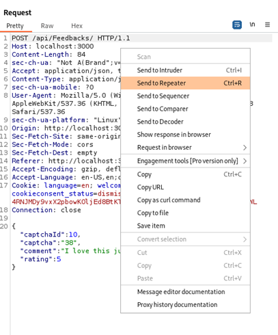

4. Selanjutnya, pergi ke tab repeater, lalu tambahkan data baru Bernama “UserId” dan berikan angka pada data “UserId” tersebut lalu klik tombol send

    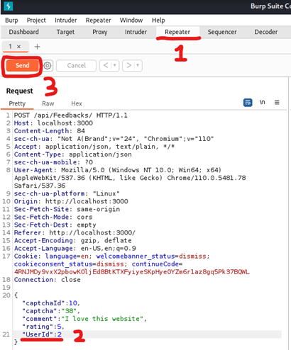

5. Muncul pesan response success dengan “UserId” orang lain tanpa login

    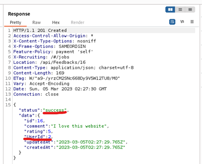

### B. Forged Feedback   

Posting ulasan produk sebagai pengguna lain atau edit ulasan pengguna yang sudah ada

1.	Login as admin first using injection

    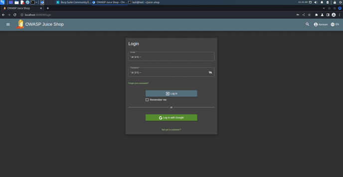

2.	Review produk

    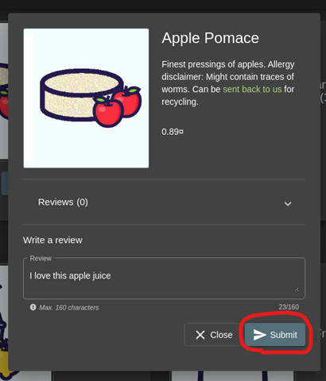

3.	Buka burp suite lalu check endpoint terakhir pada HTTP History dengan method PUT dan kirim ke repeater

    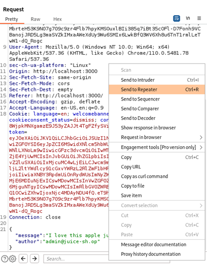

4.	Ubah request body, dengan mengubah “author” menjadi email pengguna lain yang terdaftar lalu submit

    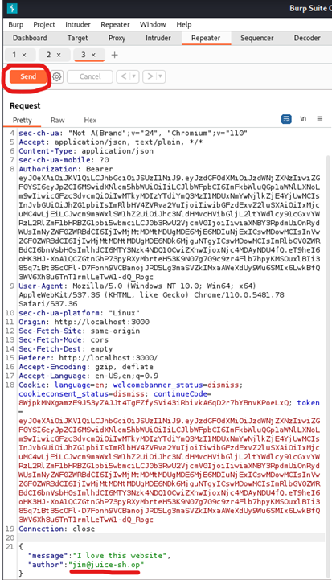

5.	Muncul pesan berhasil menambahkan review product menggunakan user lain

    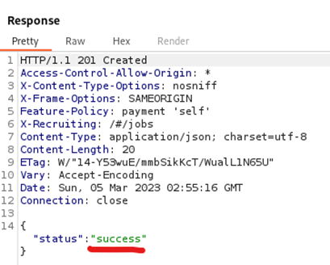
     
    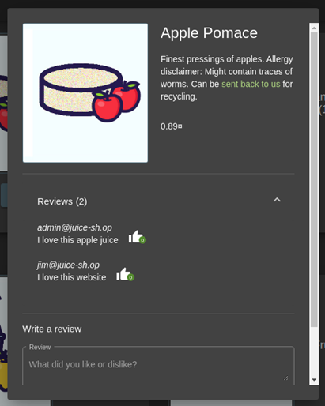

### C. Manipulate Basket

Masukkan produk tambahan ke keranjang belanja pengguna lain

1.	Register a new user account

    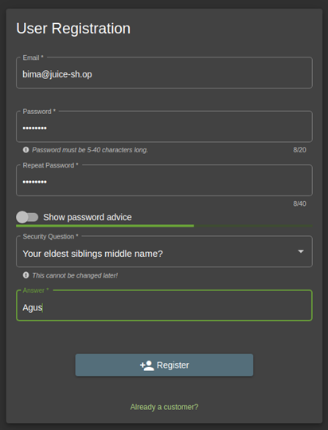

    Belum ada produk pada basket

    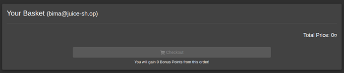

2.	Login sebagai user lain selain yang kita daftar sebelumnya semisal admin

3.	Tambahkan 1 produk ke keranjang
    
    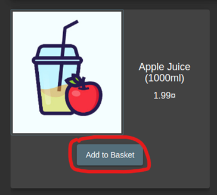

4.	Buka burp suite dan check endpoint terakhir untuk mengupdate keranjang lalu kirim ke repeater
    
    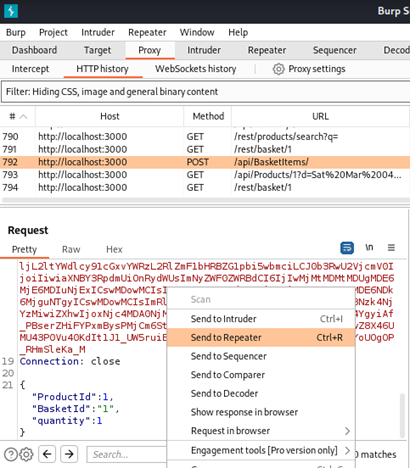

5.	Pada repeater ubah request body data “BasketId” menjadi double, lalu klik tombol send, maka akan muncul response berhasil menambahkan ke keranjang dengan “BasketId” 6
    
    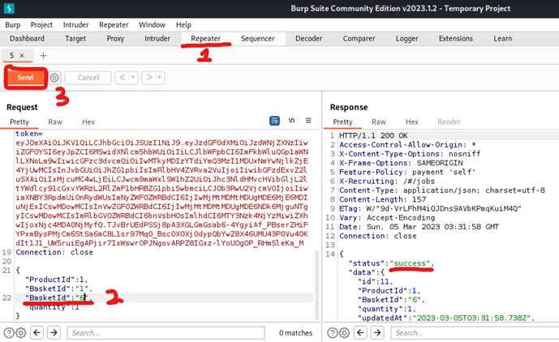
     
    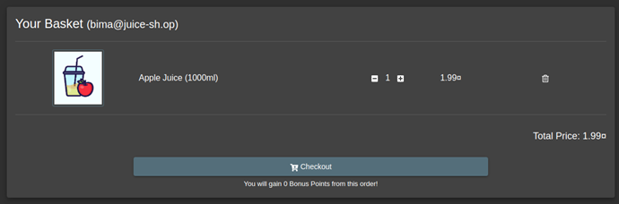

### D. Product Tempering

1.	Login sebagai admin terlebih dahulu menggunakan injection

2.	Buka burb suite dan cari endpoint search product dan kirim ke repeater

    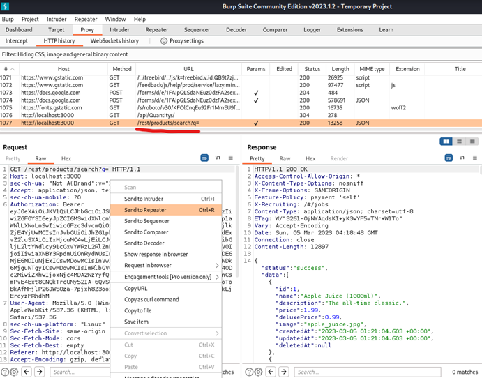

3.	Endcode “OWASP SSL Advanced Forensic Tool (O-Saft)” sebagai url lalu masukan kedalam url parameter pada repeater yang baru kita kirimkan sebelumnya. Setelah itu klik tombol send

    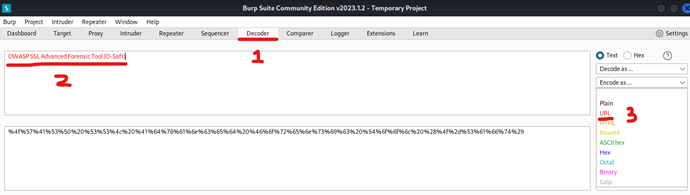
     
    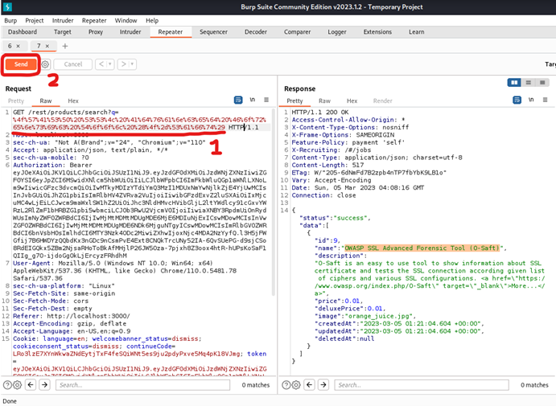

4.	Dengan menggunakan langkah sebelumnya, kita akan mendapatkan “id” dari produk “OWASP SSL Advanced Forensic Tool (O-Saft)”. Setelah itu, kita buat repeater baru dari repeater search produk ini. Kita ubah url nya, menambahkan header Content-Type dan request body untuk mengupdate deskripsi produk yang memiliki “id” 9. Selanjutnya kita klik tombol send, maka akan muncul response berhasil dan deskripsi yang telah berubah.

    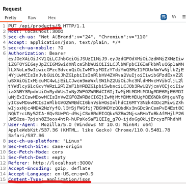
     
    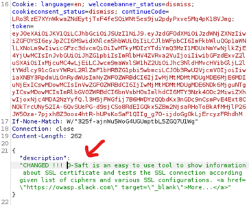
     
    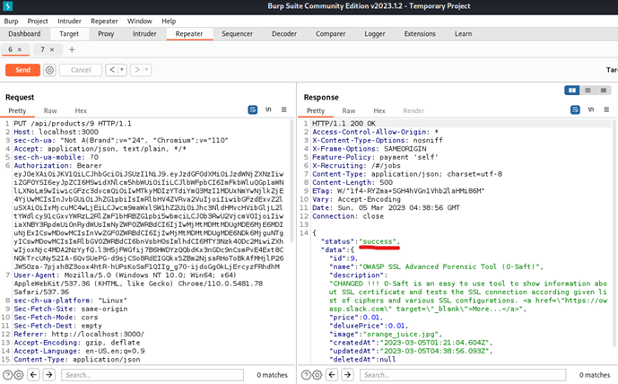