## Cover

<h3 align="center">
    <b>Kemanan Jaringan</b> 
    A02 Cryptographic Failures
</h3>
 

  

 

    Nama : Saifudin  
    NRP : 3122640046

 

    Dosen pengampu: 
    Ferry Astika Saputra, S.T., M.Sc.

 

    <b>
        KELAS D4 LJ IT B  
        JURUSAN D4 LJ TEKNIK INFORMATIKA  
        DEPARTEMEN TEKNIK INFORMATIKA DAN KOMPUTER   
        POLITEKNIK ELEKTRONIKA NEGERI SURABAYA  
        2023
    </b>

 

## Laporan

Kegagalan kriptografi merupakan kerentanan keamanan yang serius pada aplikasi web, dimana data sensitif aplikasi dapat terpapar karena algoritma kriptografi yang tidak kuat atau tidak digunakan sama sekali. Jenis data yang bisa terpapar termasuk kata sandi, catatan medis, informasi bisnis, informasi kartu kredit, alamat email, dan informasi pribadi lainnya.

Pada aplikasi web modern, data sering kali diproses baik dalam keadaan diam maupun transit, sehingga memerlukan perlindungan keamanan yang ketat untuk mencegah ancaman yang komprehensif. Namun, beberapa implementasi aplikasi web masih menggunakan teknik kriptografi yang lemah dan mudah ditembus dalam waktu yang relatif singkat. Bahkan ketika teknik kriptografi yang kuat digunakan, jika pengguna tidak menerapkan praktik perlindungan data terbaik, maka informasi sensitif masih dapat menjadi rentan terhadap pencurian data sensitif.

Berikut ini macam-macam Cryptographic Failures yang berhasil ditemukan pada Website OWASP Juice Shop:
### A. Nested Easter Egg 

Easter Egg merupakan pesan tersembunyi yang telah disisipkan kedalam website

1. Pergi kelaman github yang ada pada bagian sidebar menu website OWASP Juice Shop.

    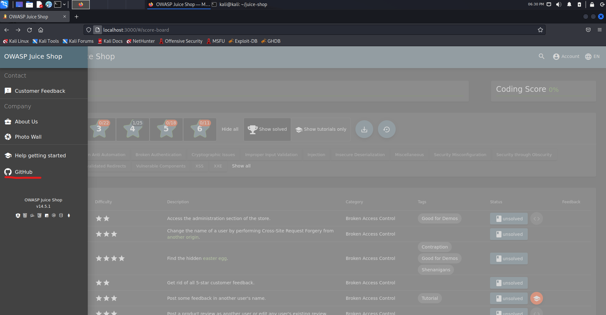
    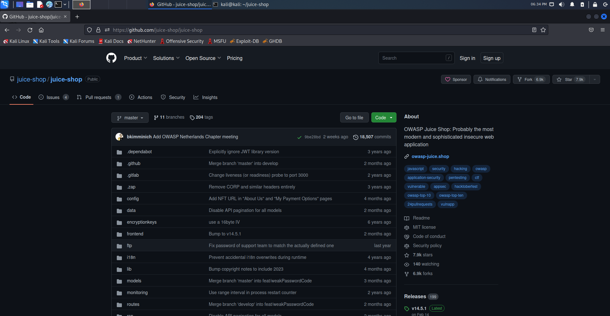

2. Selanjutnya pergi ke folder /ftp/eastere.gg maka kita akan melihat kode seperti pada gambar dibawah ini yaitu "L2d1ci9xcmlmL25lci9mYi9zaGFhbC9ndXJsL3V2cS9uYS9ybmZncmUvcnR0L2p2Z3V2YS9ndXIvcm5mZ3JlL3J0dA=="

    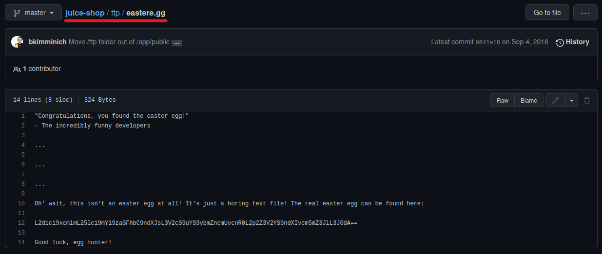

3. Selanjutnya buka website [CyberChef](https://gchq.github.io/CyberChef/) 

    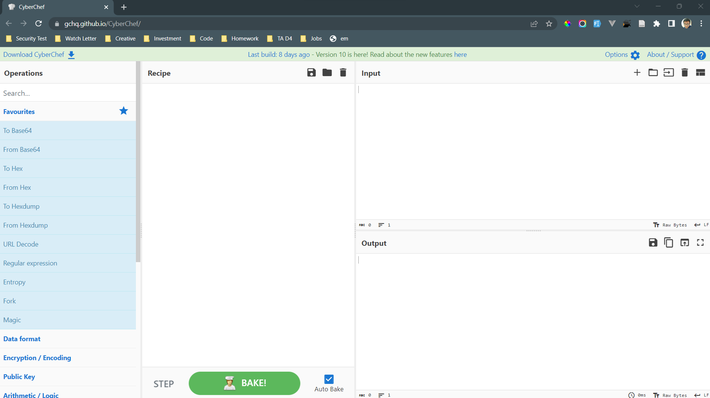

4. Masukkan operasi "From Base 64" dan "ROT 13"

    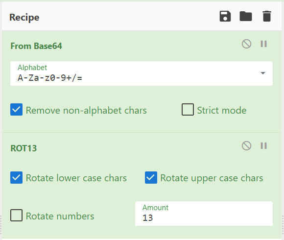

5. Masukkan kode yang kita dapatkan dari github kedalam input maka pada bagian output kita akan mendapatkan string seperti sebuah alamat URL website

    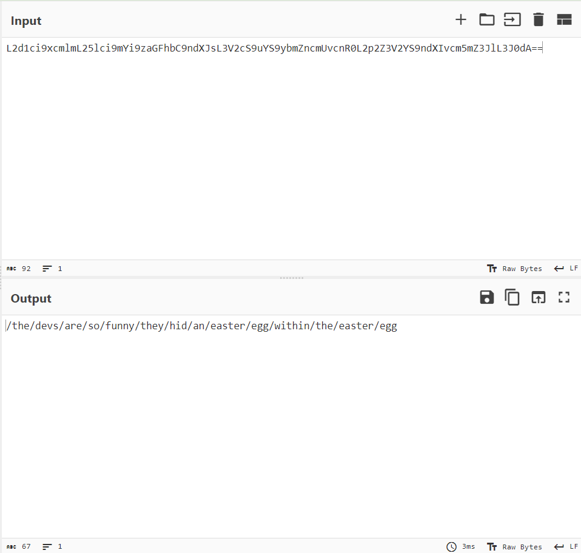

6. Kita coba masukkan URL tersebut ke web OWASP Juice Shop kita, maka akan memunculkan halaman website seperti pada gambar dibawah ini

    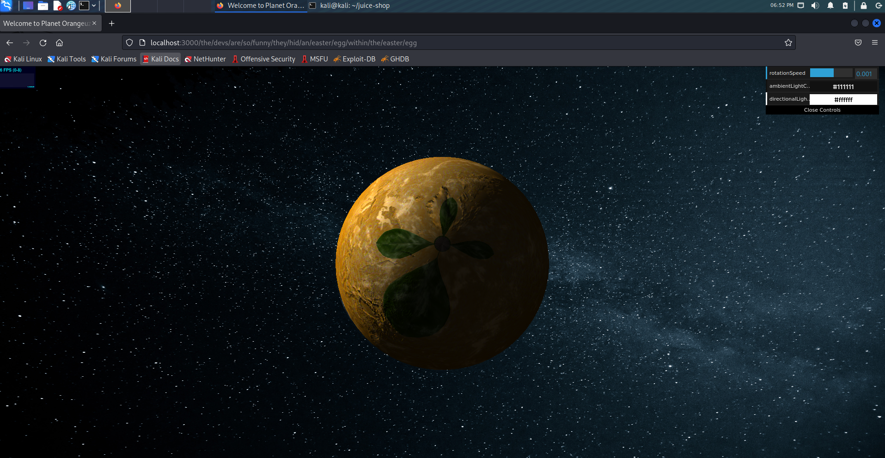

### B. Weird Crypto

Memberi tahu toko tentang algoritma atau library enkripsi yang seharusnya tidak digunakan.

1. Pada web OWASP Juice Shop, pergi kehalaman customer feedback yang berada pada sidebar menu web

    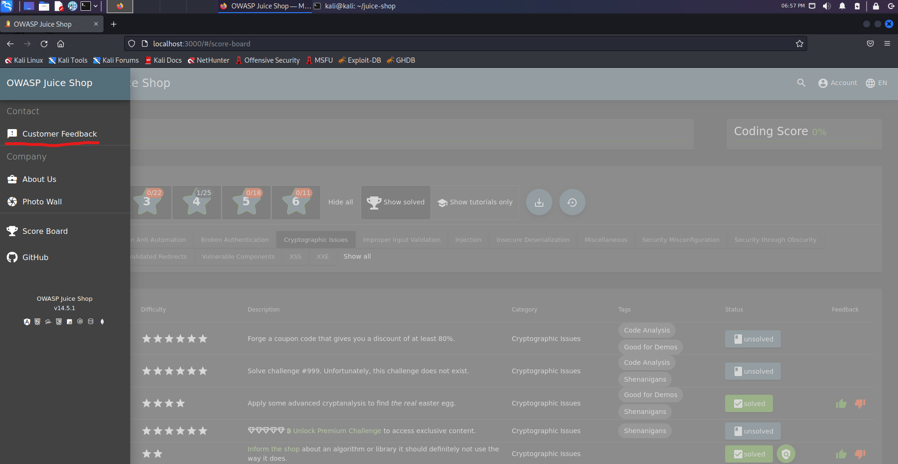
    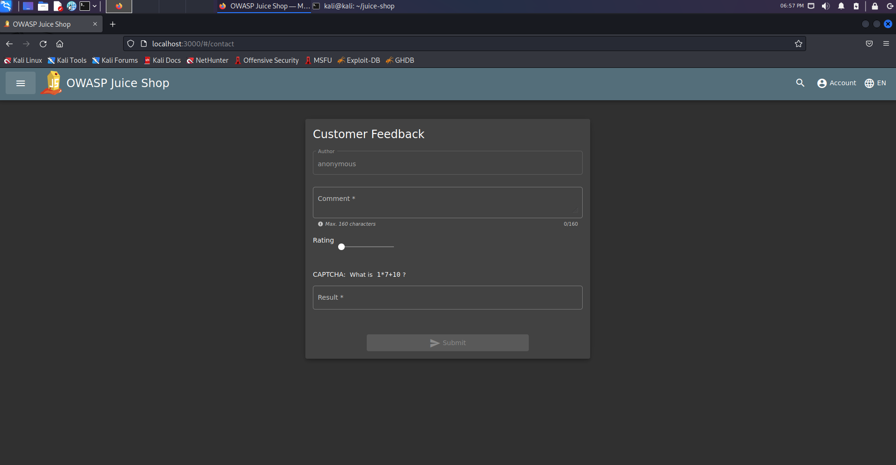

2. Masukkan comment dengan inputan "MD5" lalu submit jawaban. Maka setelah itu akan muncul notifikasi berhasil menyelesaikan challange Weird Crypto

    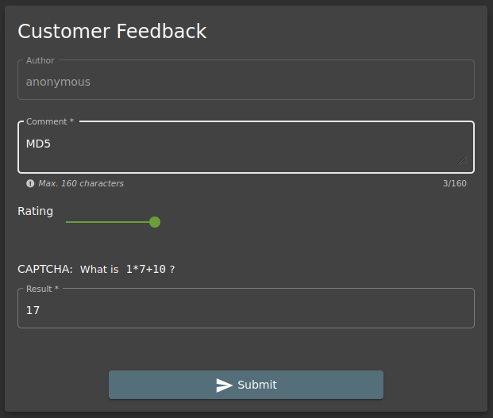
    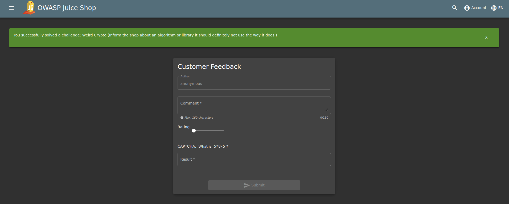

Pesan yang ingin disampaikan dari challange Weird Crypto ini adalah, kita sudah harus tau algoritma atau library enkripsi apa yang sebaiknya kita gunakan dan yang sudah harus kita tinggalkan. Salah satu contoh algoritma yang sebaiknya sudah ditinggalkan adalah MD5.

MD5 adalah versi lama dari alogaritma kriptografi, di mana kata kunci masih bisa menggunakan 4 huruf. Didesain oleh Ronald Rivest pada 1991. Lima tahun kemudian, pada 1996 ditemukan cacat dalam desainnya sehingga mulai ditinggalkan dan digantikan dengan alogaritma baru seperti SHA-1 dan SHA-2. Saat ini, di pasaran juga tersedia aplikasi untuk membuka enkripsi MD5 yang disebut "MD5 Hash Generator". Secara teori enkripsi MD5 memang kurang aman dibanding SHA2 sebab hanya memiliki panjang 128 bit.[[2]](https://cyberthreat.id/read/6609/Password-Tokopedia-yang-Bocor-Dienkripsi-Algoritma-MD5-Amankah)

