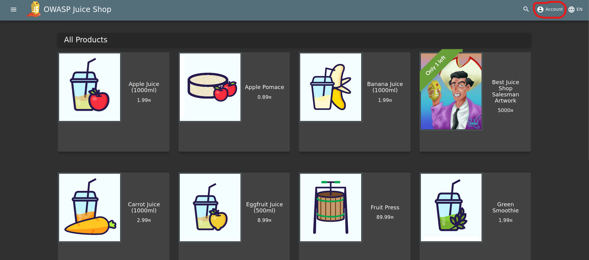
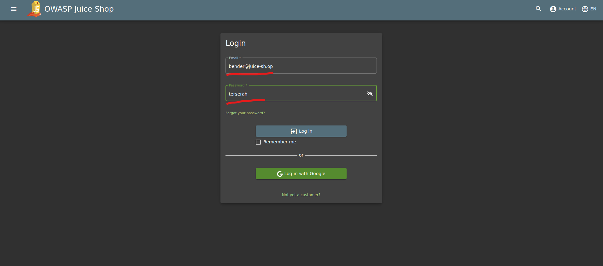
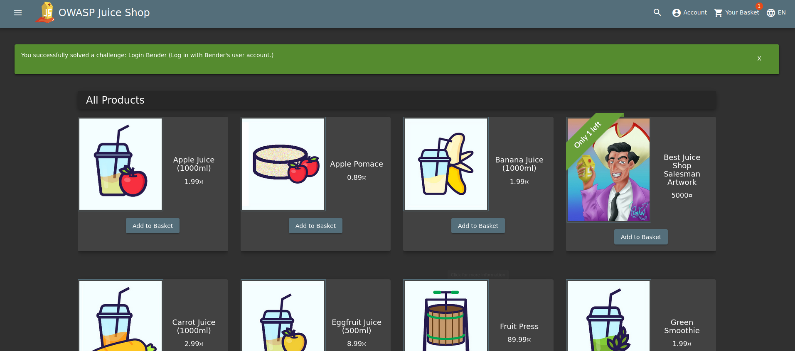
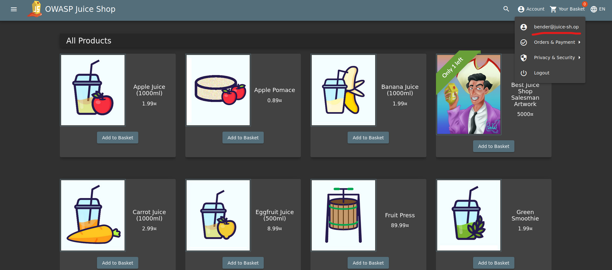
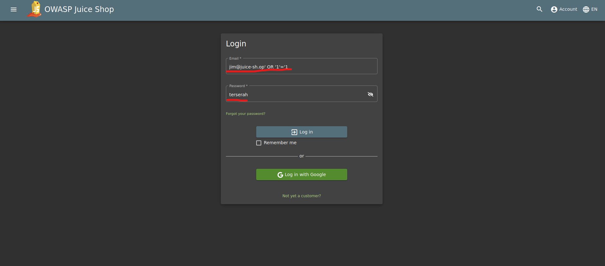
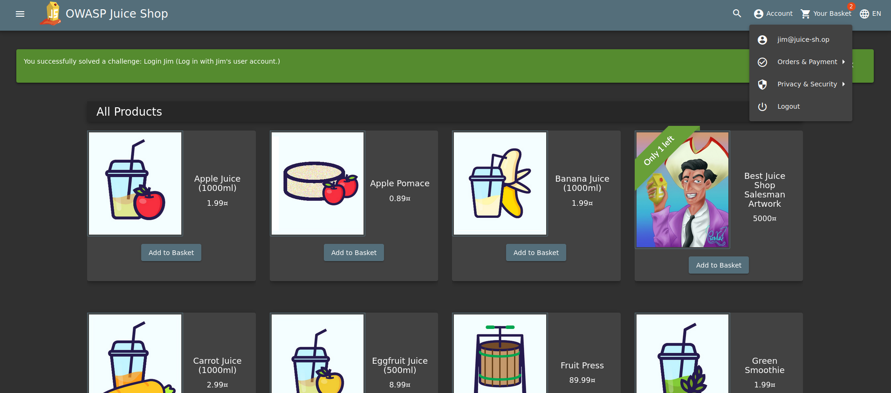

## Cover

<h3 align="center">
    <b>Kemanan Jaringan</b> 
    A03 Injection
</h3>
 

  

 

    Nama : Saifudin  
    NRP : 3122640046

 

    Dosen pengampu: 
    Ferry Astika Saputra, S.T., M.Sc.

 

    <b>
        KELAS D4 LJ IT B  
        JURUSAN D4 LJ TEKNIK INFORMATIKA  
        DEPARTEMEN TEKNIK INFORMATIKA DAN KOMPUTER   
        POLITEKNIK ELEKTRONIKA NEGERI SURABAYA  
        2023
    </b>

 

## Laporan

SQL Injection (SQLi) merupakan jenis serangan injeksi yang memungkinkan untuk mengeksekusi statement SQL yang berbahaya. Statement yang digunakan ini dapat mengontrol server database di belakang aplikasi web.

Hacker dapat melakukan otentikasi dan otorisasi halaman web atau aplikasi web dan mengambil konten dari seluruh database SQL. Mereka juga dapat menggunakan SQL Injection untuk menambah, mengubah, dan menghapus catatan dalam database.

Serangan SQL Injection ini dapat menarget semua website yang memanfaatkan SQL database, seperti MySQL, PostgreSQL, SQL Server, dan lainnya [[1](https://dqlab.id/kenali-sql-injection-dan-pencegahannya-sebelum-terlambat)].

Berikut ini macam-macam Injection yang berhasil ditemukan pada Website OWASP Juice Shop:

### A. Bender Login

Bender login adalah login menggunakan akun email bender@juice-sh.op menggunakan injection

1. Masuk kehalaman login dengan melakukan klik account pada bagian navbar lalu klik login

    

2. Selanjutnya pada halaman login ini masukkan email bender@juice-sh.op dan dengan password diisi dengan inputan acak. Untuk melakukan injection tambahkan ' -- yang dimana maksud dari inputan tersebut adalah digunakan untuk menonaktifkan argumen query sql setelahnya atau melakukan comment jadi kita dapat menonaktifkan kondisi pengecekan passwordnya

    

3. Submit login form, maka kita akan berhasil masuk sebagai user bender

    
    

### B. Jim Login

Sama seperti Bender login, Jim Login adalah login menggunakan akun email jim@juice-sh.op menggunakan injection

1. Pada web OWASP Juice Shop, pergi kehalaman customer feedback yang berada pada sidebar menu web

    

2. Selanjutnya pada halaman login ini masukkan email jim@juice-sh.op dan dengan password diisi dengan inputan acak. Untuk melakukan injection tambahkan ' OR '1'='1 yang dimana maksud dari inputan tersebut adalah digunakan untuk menambahkan kondisi jika 1=1 maka kondisi return pasti sama dengan true, maka login akan berhasil dilakukan

    

3. Submit login form, maka kita akan berhasil masuk sebagai user jim
    

