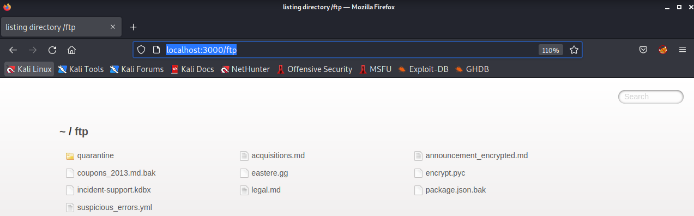
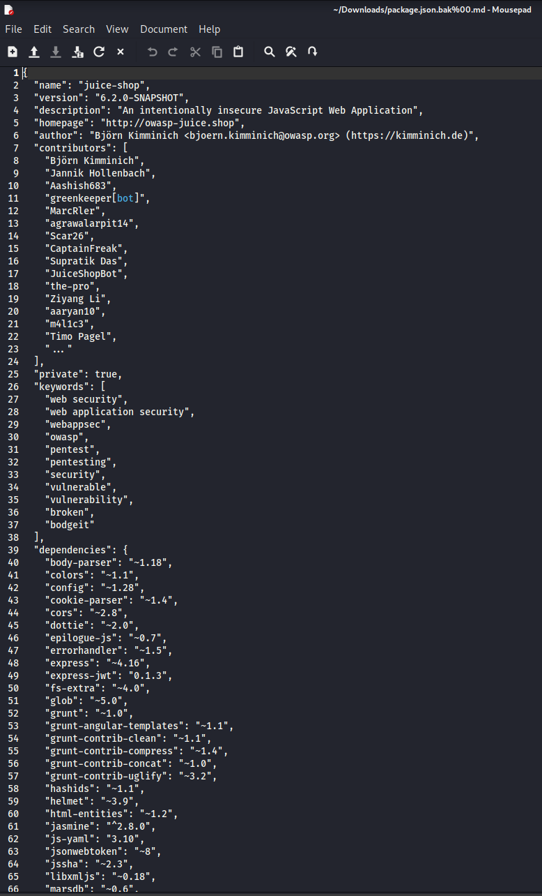
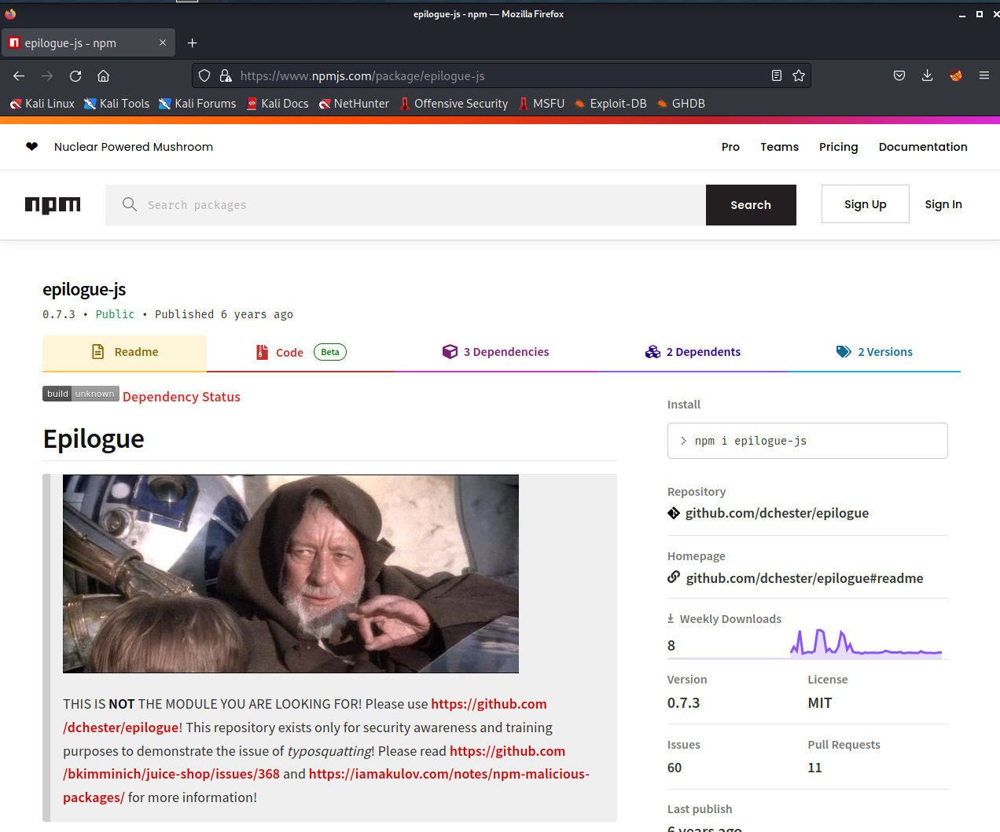
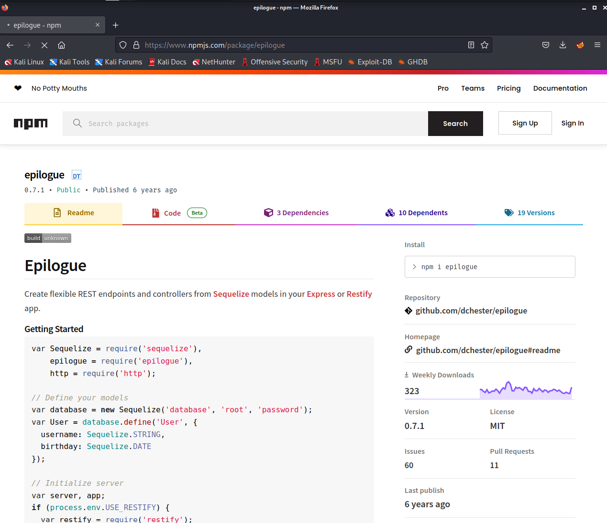
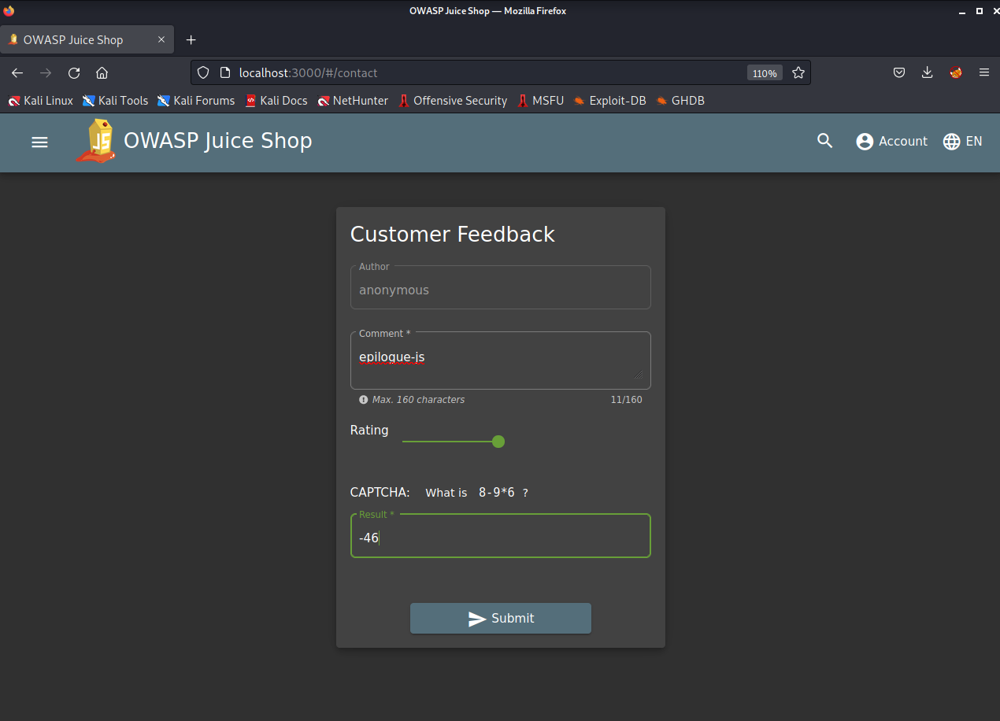

## Cover

<h3 align="center">
    <b>Praktikum Kemanan Jaringan</b> 
    A6 Vulnerable Components (OWASP 10 Juice Shop)
</h3>
 

  

 

    Nama : Saifudin  
    NRP : 3122640046

 

    Dosen pengampu: 
    Ferry Astika Saputra, S.T., M.Sc.

 

    <b>
        KELAS D4 LJ IT B  
        JURUSAN D4 LJ TEKNIK INFORMATIKA  
        DEPARTEMEN TEKNIK INFORMATIKA DAN KOMPUTER   
        POLITEKNIK ELEKTRONIKA NEGERI SURABAYA  
        2023
    </b>

 

## Laporan

A06:2001 tentang Vulnarable Component membahas tentang komponen yang digunakan untuk membangun aplikasi kita telah usang atau memiliki kerentanan. Masalah ini juga ada di daftar 10 Teratas tahun 2017 dan telah mendapatkan posisi yang lebih baik: #6, sementara itu berada di posisi #9 di tahun 2017 dan diberi nama Using Components with Known Vulnerabilities. Percaya atau tidak, mengelola dependensi Anda adalah pekerjaan yang berat. Ini tidak sesederhana menjalankan perintah pembaruan atau mengunduh dependensi & paket yang diperbarui. Tapi lebih dari ini: aplikasi Anda mungkin rusak dengan perubahan terbaru, beberapa fitur mungkin tidak digunakan lagi, fungsi mungkin diganti namanya, dependensi mungkin ditinggalkan, perbaikan mungkin tidak berfungsi pada sistem Anda tanpa merusak beberapa dependensi lain, membuat malapetaka. Anda mendapatkan ide yang benar [[1](https://medium.com/@shivam_bathla/a06-2021-vulnerable-and-outdated-components-a5d96017049c)].

### A. Legacy Typosquatting

Typosquatting , juga disebut URL hijacking, sting site, atau fake URL, adalah bentuk cybersquatting , dan kemungkinan brandjacking yang bergantung pada kesalahan seperti kesalahan ketik yang dibuat oleh pengguna Internet saat memasukkan alamat situs web ke dalam browser web. Jika pengguna secara tidak sengaja memasukkan alamat situs web yang salah, mereka dapat diarahkan ke URL apa pun (termasuk situs web alternatif yang dimiliki oleh cybersquatter). Ini bisa merujuk ke goggle.com. Goggle.com adalah situs web berbahaya salah ketik yang bahkan dapat membahayakan komputer Anda dan menghapus ROM Anda dalam 30 detik [[2](https://en.wikipedia.org/wiki/Typosquatting)].

1. Langkah pertama kita pergi ke URL berikut http://localhost:3000/ftp

   

2. Setelah itu kita akan ditunjukkan list file yang ada pada directory ftp ini seperti gambar diatas. Kita buka file yang bernama package.json.bak

   

3. Setelah itu akana muncul tampilan seperti pada gambar diatas yang menampilkan error bahwa file tersebut tidak bisa dibuka. Kita ubah sedikit URL setelah pergi ke halaman package.json.bak menjadi seperti berikut http://localhost:3000/ftp/package.json.bak%2500.md

   

4. Setelah menjalankan URL tersebut kita akan mendownload file yang berisi package json aplikasi website tersebut

   

5. Dari file package json ini kita coba check dependencies apa saja yang digunakan oleh aplikasi ini. Setelah itu kita melihat salah satu dependencies yang sepertinya tidak seharusnya atau typo dalam penulisannya tetapi dapat digunakan yaitu yang bernama epilogue-js. Ketika kita buka pada website npm muncul tampilan sebagai berikut

   

6. Untuk package yang seharusnya digunakan adalah package epilogue bukan epilogue-js

   

7. Kita informasikan temuan kita ini pada customer feedback untuk menyelesaikan challange ini

   
   
