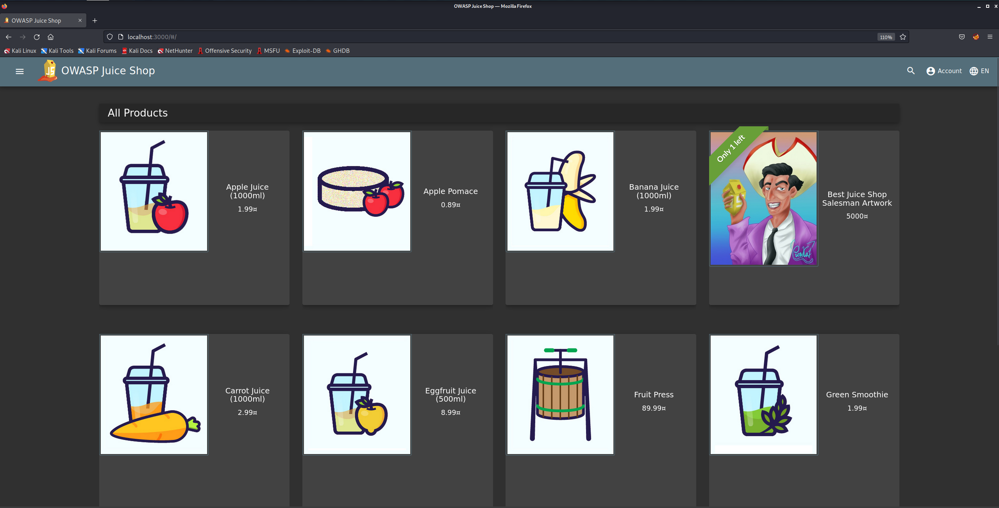
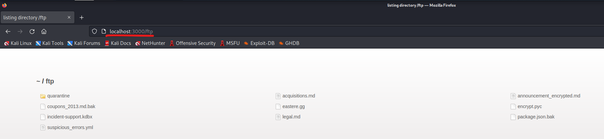
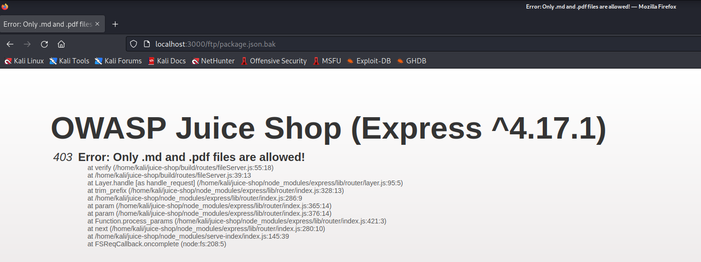
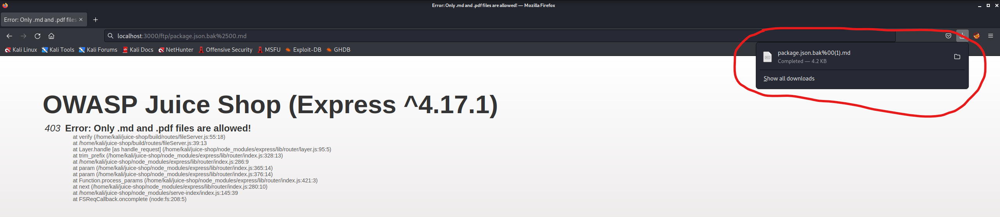
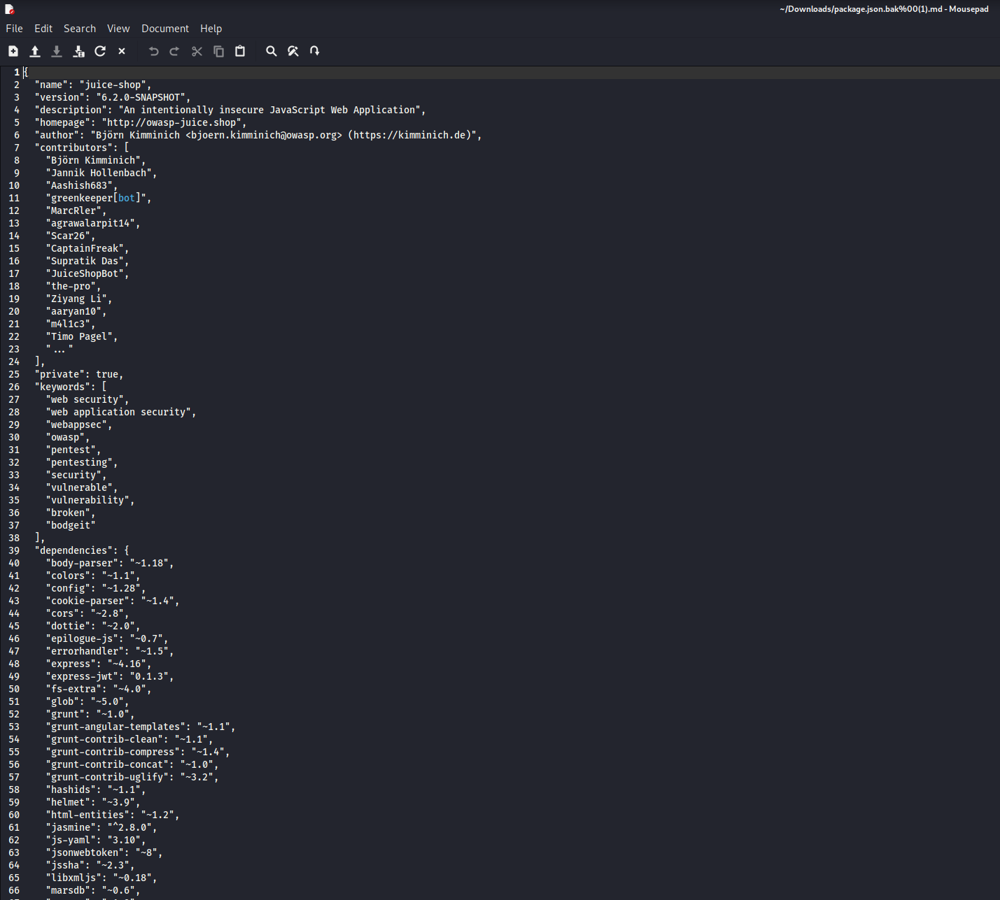

## Cover

<h3 align="center">
    <b>Praktikum Kemanan Jaringan</b> 
    A8 Software and Data Integrity Failures (OWASP 10 Juice Shop)
</h3>
 

  

 

    Nama : Saifudin  
    NRP : 3122640046

 

    Dosen pengampu: 
    Ferry Astika Saputra, S.T., M.Sc.

 

    <b>
        KELAS D4 LJ IT B  
        JURUSAN D4 LJ TEKNIK INFORMATIKA  
        DEPARTEMEN TEKNIK INFORMATIKA DAN KOMPUTER   
        POLITEKNIK ELEKTRONIKA NEGERI SURABAYA  
        2023
    </b>

 

## Laporan

A08:2021 adalah pendatang baru dan berbicara tentang bahaya yang terlihat/tidak terlihat yang dibawa oleh perangkat lunak/aplikasi era modern. Sering disebut sebagai Software and Data Integrity Failures OWASP, ini berbicara tentang asumsi yang terkait dengan critical CI/CD pipeline, penanganan data, dan kegagalan integritas pembaruan perangkat lunak. Dalam bahasa awam, ketika seseorang menggunakan perangkat lunak/aplikasi/data penting tanpa mengikuti praktik verifikasi atau autentikasi terbaik, beberapa pendekatan ancaman dan A08:2021 mencakup semuanya. Tidak melalui proses otentikasi menciptakan peluang bagi peretas/aktor ancaman untuk mendapatkan akses resmi ke aplikasi/perangkat lunak yang dibatasi. Setelah itu terjadi, mereka dibiarkan menyebabkan malapetaka tanpa akhir seperti injeksi kode berbahaya, pencurian data, dan mengendalikan operasi aplikasi/perangkat lunak [[1](https://www.wallarm.com/what/a04-2021-owasp-software-and-data-integrity-failures)].

### Percobaan

Pada percobaan ini akan menunjukan mengunduh kode tanpa pemeriksaan integritas.

1. Buka Aplikasi Juice Shop.

   

2. Tambahkan /ftp pada URL Juice Shop kita menjadi http://localhost:3000/ftp

   

3. Klik package.json.bak, maka akan muncul tampilan sebagai berikut

   

4. ubah URL pakcage.json.bak menjadi sebagai berikut localhost:3000/ftp/package.json.bak%2500.md lalu jalankan, maka kita akan mendownload file package.json tersebut seperti pada gambar berikut

   

5. ubah URL pakcage.json.bak menjadi sebagai berikut localhost:3000/ftp/package.json.bak%2500.md lalu jalankan, maka kita akan mendownload file package.json tersebut seperti pada gambar berikut

   
   

   Berikut adalah isi dari file package.json yang berhasil terdownload
