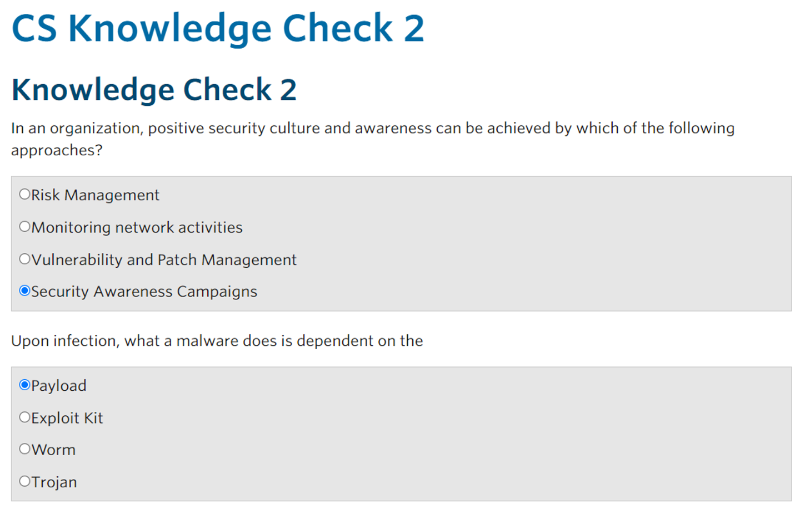
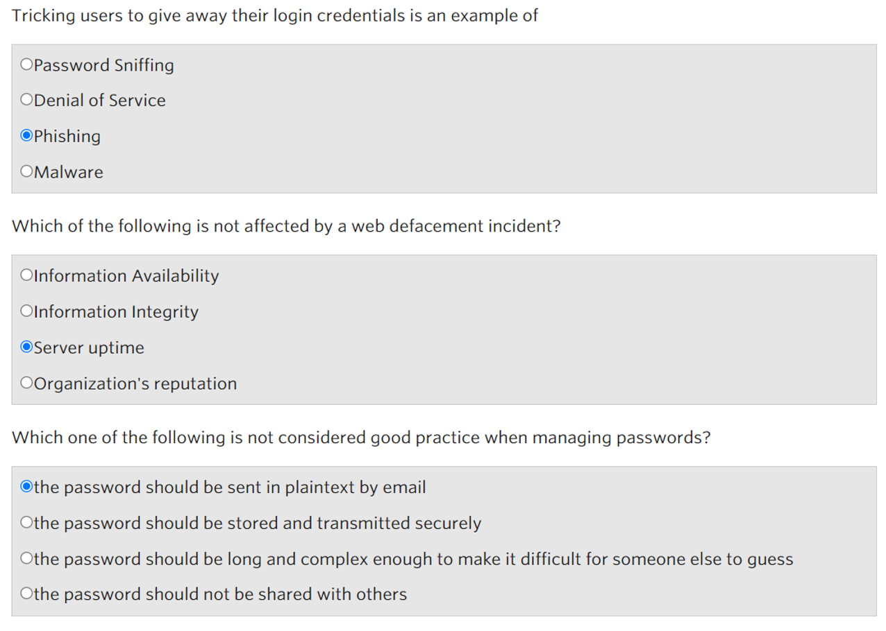
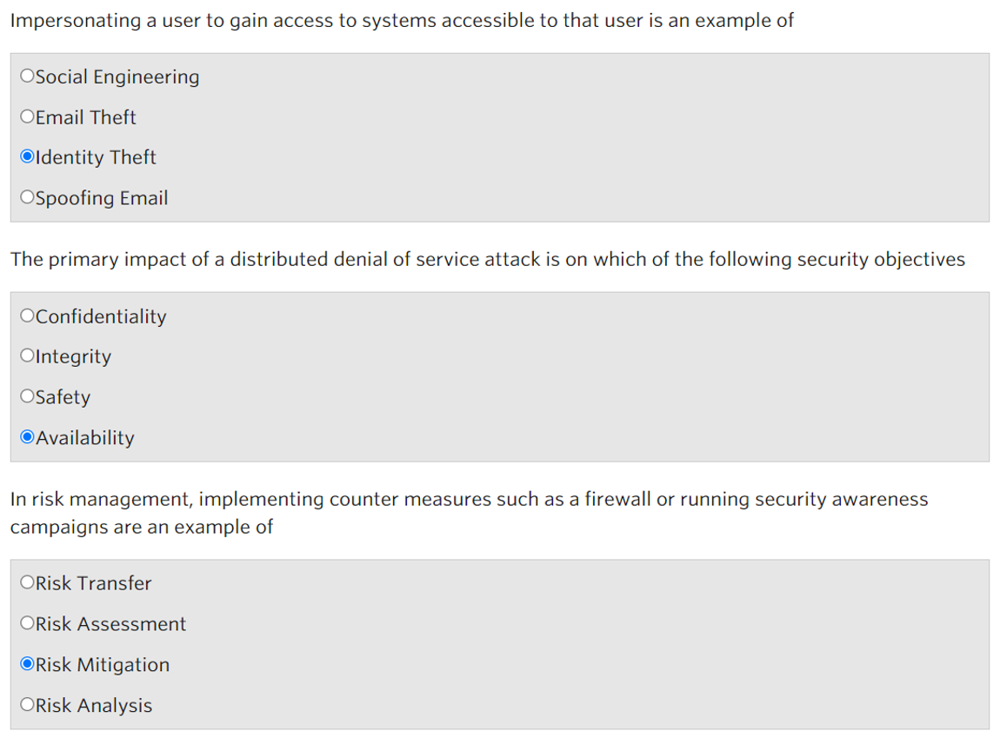
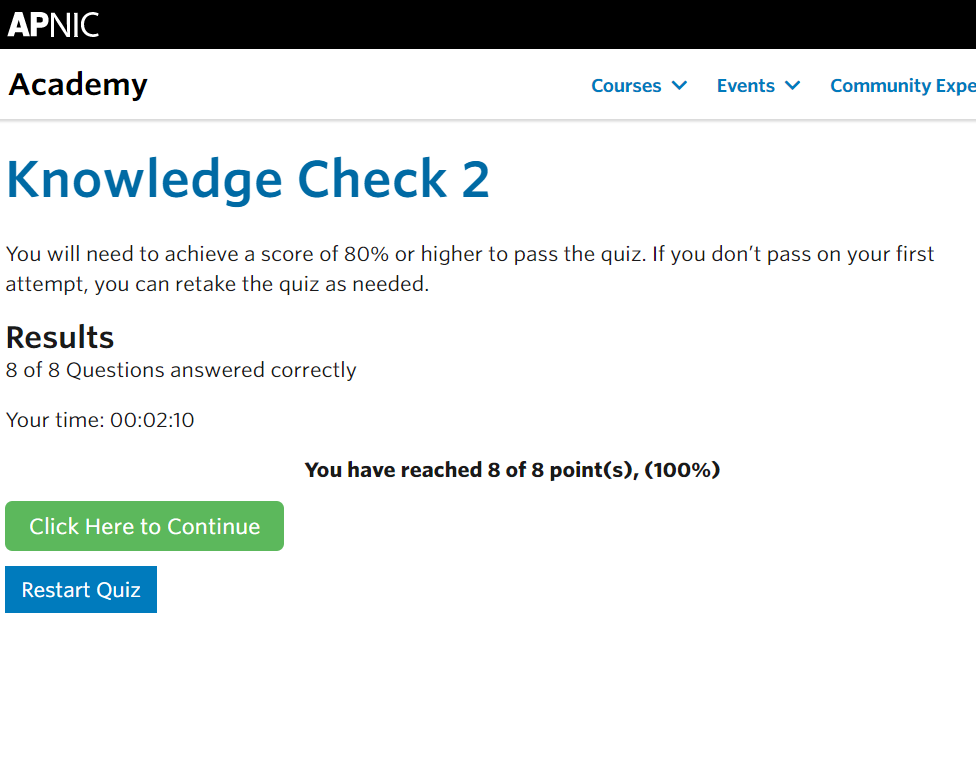

## Cover

<h3 align="center">
    <b>Kemanan Jaringan</b> 
    Cyber Security In The Organization
</h3>
 

  

 

    Nama : Saifudin  
    NRP : 3122640046

 

    Dosen pengampu: 
    Ferry Astika Saputra, S.T., M.Sc.

 

    <b>
        KELAS D4 LJ IT B  
        JURUSAN D4 LJ TEKNIK INFORMATIKA  
        DEPARTEMEN TEKNIK INFORMATIKA DAN KOMPUTER   
        POLITEKNIK ELEKTRONIKA NEGERI SURABAYA  
        2023
    </b>

 

## Laporan

Modul 2 membahas tentang keamanan siber pada organisasi. Alasan utama mengapa sebuah organisasi membutuhkan keamanan adalah karena ancaman terhadap organisasi dapat sangat merugikan perusahaan. Sebelum mengidentifikasi risiko keamanan, perlu dipahami dampaknya terhadap organisasi, seperti gangguan pada operasi bisnis, meningkatnya biaya operasi bisnis, tidak dapat memberikan layanan sesuai kontrak, dan citra organisasi terpengaruh. Untuk menghindari dampak tersebut, diperlukan upaya untuk mengidentifikasi dan mengelola risiko yang dapat mengganggu aktivitas organisasi. Upaya pertama adalah melakukan mitigasi atau mengurangi dampak risiko dengan cara pengembangan kontrol keamanan. Upaya selanjutnya adalah transfer risiko agar dapat ditangani oleh organisasi lain, seperti asuransi.  

Cara meningkatkan kesiapsiagaan keamanan siber antara lain:

1. Menyadari tingkat dan kemungkinan risiko organisasi agar lebih proaktif dan siap
2. Melibatkan orang di seluruh organisasi untuk meningkatkan kualitas pengambilan keputusan dalam mengelola risiko
3. serta menginvestasikan sumber daya dan mengembangkan program keamanan siber yang komprehensif.

Beberapa ancaman keamanan siber umum terhadap organisasi antara lain:

Bagaimana cara meningkatkan kesiapsiagaan keaamanan cyber? berikut ini adalah cara-cara yang dapat dilakukan:

- Serangan Denial of Service
- Malware
- Identity Theft
- Web Defacement

Untuk mengurangi risiko serangan siber, perlu menerapkan kontrol teknis untuk mendeteksi dan mencegah seperti firewall, filter spam, sistem deteksi intrusi, dan perangkat lunak antivirus. Selain itu, perlu memberikan pendidikan dan pelatihan karyawan, terutama dalam menghadapi phishing dan mengembangkan aplikasi web dengan aman, serta memastikan bahwa penyedia jaringan memiliki kemampuan untuk mendukung saat diserang.

## Screenshot

 
 
 

